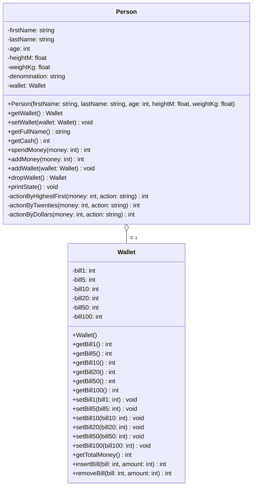

```mermaid
classDiagram
    class Person {
        -firstName: string
        -lastName: string
        -age: int
        -heightM: float
        -weightKg: float
        -denomination: string
        -wallet: Wallet
        +Person(firstName: string, lastName: string, age: int, heightM: float, weightKg: float)
        +getWallet() Wallet
        +setWallet(wallet: Wallet) void
        +getFullName() string
        +getCash() int
        +spendMoney(money: int) int
        +addMoney(money: int) int
        +addWallet(wallet: Wallet) void
        +dropWallet() Wallet
        +printState() void
        -actionByHighestFirst(money: int, action: string) int
        -actionByTwenties(money: int, action: string) int
        -actionByDollars(money: int, action: string) int
    }
    
    class Wallet {
        -bill1: int
        -bill5: int
        -bill10: int
        -bill20: int
        -bill50: int
        -bill100: int
        +Wallet()
        +getBill1() int
        +getBill5() int
        +getBill10() int
        +getBill20() int
        +getBill50() int
        +getBill100() int
        +setBill1(bill1: int) void
        +setBill5(bill5: int) void
        +setBill10(bill10: int) void
        +setBill20(bill20: int) void
        +setBill50(bill50: int) void
        +setBill100(bill100: int) void
        +getTotalMoney() int
        +insertBill(bill: int, amount: int) int
        +removeBill(bill: int, amount: int) int
    }
    
    Person o-- "0..1" Wallet
```