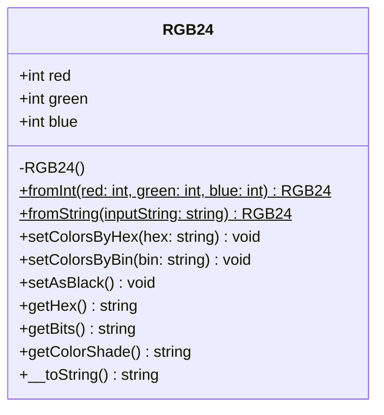

```mermaid
classDiagram
    class RGB24 {
        +int red
        +int green
        +int blue
        -RGB24()
        +fromInt(red: int, green: int, blue: int) RGB24$
        +fromString(inputString: string) RGB24$
        +setColorsByHex(hex: string) void
        +setColorsByBin(bin: string) void
        +setAsBlack() void
        +getHex() string
        +getBits() string
        +getColorShade() string
        +__toString() string
    }
```